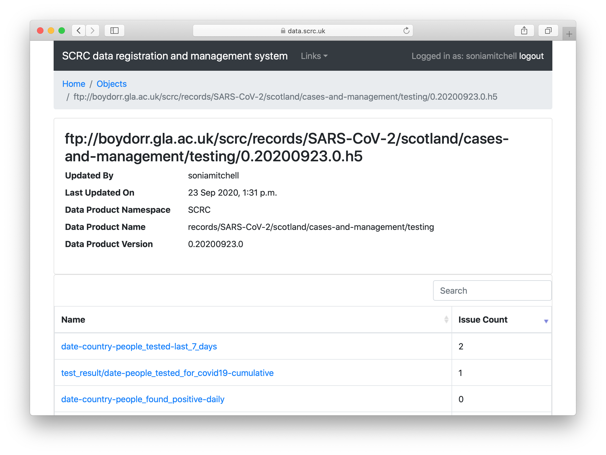
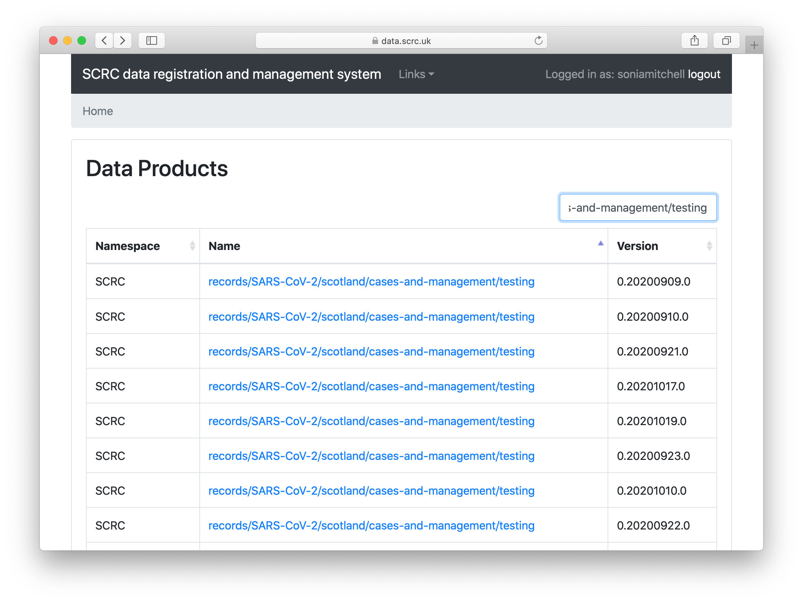

# How to generate a data product

The data product itself should be producted in the correct format:

* Point estimates, distributions, and samples should be generated as TOML files (`*.toml`)
* Tables and arrays should be generated as HDF5 files (`*.h5`/`*.hdf5`)
* The filename (of the TOML or HDF5 file) should be the version number of the data product

## Filenames and version numbers

* The version of a data product is identified by its filename
* The version of a raw data file is the same as that of the data product

### When a dataset is static (downloaded only once)

Filenames are written `major.minor.patch.extension`, *e.g.* `0.1.0.toml`, `0.1.0.h5`, `0.1.0.csv`.

Major
: Changes only for the initial stable release (go from `0.y.z` to `1.0.0`) and when incompatible changes are made

Minor
: Changes when new functionality is added such as a new component, or for the initial release that is *probably* stable, or a script that definitely works better even though the output is technically the same (go from `0.0.z` to `0.y.0`)

Patch
: Changes for small bug fixes

### When a dataset is dynamic (downloaded daily, weekly, etc.)

Filenames are written thus (named after the download date):

* `1.20200716.0.csv`
* `1.20200716.0.h5`

For example, you might want to start the disease data with `0.20200722.0`, etc. until you're really confident that it's all good and you're happy to make a `1.2020mmdd.0` release.

If there's a bugfix to the dataset, then you'd go from `1.20200716.0.csv` to `1.20200716.1.csv`.

However if you have a completely new storage format, where you have different components and/or different formats of the components, then you go from `1.20200716.0.csv` to `2.20200716.0.csv`, because major number changes are supposed to not be backward compatible.

## Data product names

The name of a data product should be the same as its path.

In the example below, the location of a data product,
ftp://<span></span>boydorr.gla.ac.uk/scrc/records/SARS-CoV-2/scotland/cases-and-management/testing/0.20200923.0.h5[^1], is generated from:

`ftp://boydorr.gla.ac.uk/[namespace]/[data_product_name]/[version_number].h5`



Thus, the `data_product_name` is used to locate the file, as well as describe its contents (since the filename is its version number).



[^1]: Note that if you try to follow this URL using Safari, your file will be renamed to `Unknown.dms`. However, we don't recommend using this method to download files, so nothing to worry about.

## TOML files

There are only three types of TOML file:

* point-estimate
* distribution
* samples

These are all different ways of representing the estimate for a value, which can be anything - the mean of something, the standard deviation, etc.

### TOML components

You could have a data product called `latent-period` with a single point estimate:

``` toml
[latent-period]
type = "point-estimate"
value = 1.0
```

In this case, the component is taken as the last part of the name (in the above example, period).

Alternatively, the data product could have several components, for instance:

``` toml
[latent-period]
type = "distribution"
distribution = "gamma"
shape = 1.0
scale = 1.0

[mean]
type = "point-estimate"
value = 1.0

[standard-deviation]
type = "point-estimate"
value = 1.0
```

and so on.

As far as units are concerned, there will be a unit-respecting system in that (if we get the data pipeline grant) every data product component will have to say what units it is in, and the pipeline API will do conversions and error if the units aren't compatible (or aren't provided). However, it's not there yet. The only thing we can suggest at the moment is to decide to use the component names to specify the units, so add an additional component to the TOML file such as:

``` toml
[hours]
type = "point-estimate"
value = 24.0
```

The functions `create_estimate()` and `create_distribution()` can be used to generate a TOML file. Note that these functions can't be used to edit existing files. If a file already exists at the specified location, an error will be returned.

### Generate a TOML file from a point-estimate

1. Load the SCRCdataAPI package into R:

   ``` R
   library(SCRCdataAPI)
   ```

2. Choose an appropriate [filename]({}):

   ``` R
   filename <- "0.1.0.toml"
   ```

3. Choose an appropriate [data product name]({}):

   ``` R
   data_product_name <- "human/infection/SARS-CoV-2/asymptomatic-period"
   ```

4. List a single component (see [TOML components]({})):

   ``` R
   estimate <- list(`asymptomatic-period` = 192.0)
   ```

   or list multiple components with the same data product name:

   ``` R
   estimate <- list(`asymptomatic-period-1` = 192.0,
                    `asymptomatic-period-2` = 190.2)
   ```

   Note that `asymptomatic-period-1` needs to be enclosed by backticks because of the dash.

5. Write the point-estimate into a TOML file:

   ``` R
   create_estimate(filename = filename,
                   path = data_product_name,
                   parameters = estimate)
   ```

   Note that, `create_estimate()` will create the directory structure for you if it doesn't already exist. Your TOML file should now exist at `[data_product_name]/[filename]`.

### Generate a TOML file from a distribution

1. Load the SCRCdataAPI package into R:

   ``` R
   library(SCRCdataAPI)
   ```

2. Choose an appropriate [filename]({}):

   ``` R
   filename <- "0.1.0.toml"
   ```

3. Choose an appropriate [data product name]({}):

   ``` R
   data_product_name <- "human/infection/SARS-CoV-2/latency-period"
   ```

4. List a single component (see [TOML components]({})):

   ``` R
   distribution <- list(name = "latency-period",
                        distribution = "gamma",
                        parameters = list(shape = 2.0,
                                          scale = 3.0))
   ```

   or list multiple components with the same data product name:

   ``` R
   dist1 <- list(name = "latency-period-1",
                 distribution = "gamma",
                 parameters = list(shape = 2.0, scale = 3.0))
   dist2 <- list(name = "latency-period-2",
                 distribution = "gamma",
                 parameters = list(shape = 2.2, scale = 4.0))
   distribution <- list(dist1, dist2)
   ```

   or list a single distribution and associated point-estimates with the same data product name:

   ``` R
   dist <- list(name = "latency-period",
                distribution = "gamma",
                parameters = list(shape = 2.0, scale = 3.0))
   estimate1 <- list(mean = 1.0)
   estimate2 <- list(`standard-deviation` = 1.0)
   distribution <- list(dist, estimate1, estimate2)
   ```

   Note that `standard-deviation` needs to be enclosed by backticks because of the dash.

5. Write the distribution into a TOML file:

   ``` R
   create_distribution(filename = filename,
                       path = data_product_name,
                       distribution = distribution)
   ```

## HDF5 files

An HDF5 file can be either a table or an array. A table is always 2-dimentional and might typically be used when each column contains different classes of data (*e.g.* integers and strings). Conversely, all elements in an array should be the same class, though the array itself might be 1-dimensional, 2-dimensional, or more (*e.g.* a 3-dimensional array comprising population counts, with rows as area, columns as age, and a third dimension representing gender).

You should create a single HDF5 file for a single dataset. Unless you have a dataset that really should have been generated as multiple datasets in the first place (*e.g.* testing data mixed with carehome data), in which case use your own judgement.

The functions `create_array()` and `create_table()` can be used to generate an HDF5 file.

### Generate an HDF5 file from an array

1. Load the SCRCdataAPI package into R:

   ``` R
   library(SCRCdataAPI)
   ```

2. Choose an appropriate [filename]({}):

   ``` R
   filename <- "0.1.0.h5"
   ```

3. Choose an appropriate [data product name]({}):

   ``` R
   data_product_name <- "some/descriptive/name"
   ```

4. Choose an appropriate component name:

   ``` R
   component_name <- "row/column-constant"
   ```

   If your dataset contains a single data topic, then the component should be named "`array`". However, if your dataset contains multiple data topics, then these can be included as separate components within a single HDF5 file. In doing so, a particular naming convention is required. 

   For example, the human-mortality data product contains the following components:

   * `age_group/week/gender-country-all_deaths`
   * `age_group/week/gender-country-covid_related_deaths`  
   * `age_group/week-persons-country-all_deaths`

   Taking the first component as an example:

   * Dimensionality is represented by `age_group/week/gender`, corresponding to the first, second, and third dimensions of the component (rows, columns, and levels)
   * A description of the contents follows the dash, where `-country-all_deaths` describes all elements
   * Spaces are replaced with underscores

5. Source your dataset:

   ``` R
   # Here we're creating a fake dataset
   df <- data.frame(column_1 = 1:2, column_2 = 3:4)
   rownames(df) <- c("row_1", "row_2")
   ```

   Rather than creating a fake dataset like we did here, you might want to use `download_from_url()` or `download_from_database()` to source your data. These functions are well documented with examples provided in the SCRCdataAPI package.

6. Generate an HDF5 file:

   ``` R
   # Create an h5 file from a 2-dimensional array
   create_array(filename = filename,
                path = data_product_name,
                component = component_name,
                array = as.matrix(df),
                dimension_names = list(rowvalue = rownames(df),
                                       colvalue = colnames(df)))
   ```

### Generate an HDF5 file from a table

1. Load the SCRCdataAPI package into R:

   ``` R
   library(SCRCdataAPI)
   ```

2. Choose an appropriate [filename]({}):

   ``` R
   filename <- "0.1.0.h5"
   ```

3. Choose an appropriate [data product name]({}):

   ``` R
   data_product_name <- "some/descriptive/name"
   ```

4. Choose an appropriate component name:

   ``` R
   component_name <- "descriptive_component_name"
   ```

   The component naming scheme used in the previous section (generating HDF5 files from an array) doesn't make sense here. So if you have multiple data topics and therefore need multiple components in a single HDF5 file, just pick a name that's suitably descriptive. If your dataset contains a single data topic, then name the component "`table`".

5. Source your dataset:

   ``` R
   # Here we're creating a fake dataset
   df <- data.frame(column_1 = 1:2, column_2 = 3:4)
   rownames(df) <- c("informative_rowname_1", "informative_rowname_2")
   ```

   Rather than creating a fake dataset like we did here, you might want to use `download_from_url()` or `download_from_database()` to source your data. These functions are well documented with examples provided in the SCRCdataAPI package.

6. Generate an HDF5 file:

   ``` R
   # Create an h5 file from a table
   create_table(filename = filename,
                path = data_product_name,
                component = component_name,
                df = df,
                row_names = rownames(df),
                column_units = c(NA, "m^2"))
   ```

   Note that `row_names` and `column_units` are optional arguments. In this case, `row_names` is informative, but it might not always be the case. Likewise, `column_units` is shown here to demonstrate how to input the lack of units in column 1.

