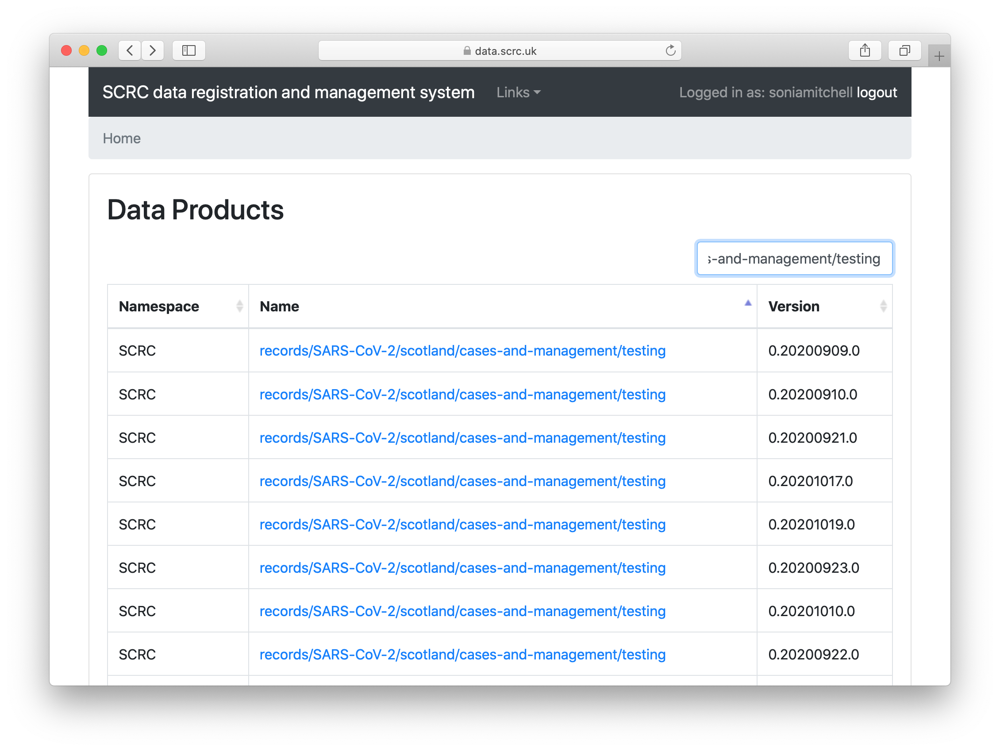

# How to name a data product

The name of a data product should be the same as its path.

In the example below, the location of a data product,
ftp://boydorr.gla.ac.uk/scrc/records/SARS-CoV-2/scotland/cases-and-management/testing/0.20200923.0.h5[^1], is generated from:

`ftp://boydorr.gla.ac.uk/[namespace]/[data_product_name]/[version_number].h5`

Thus, the `data_product_name` is used to locate the file, as well as describe its contents (since the filename is its version number).

[^1]: Note that if you try to follow this URL using Safari, your file will be renamed to `Unknown.dms`. However, we don't recommend using this method to download files, so nothing to worry about.
