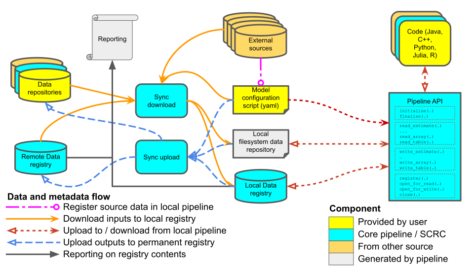

# Data pipeline

The data pipeline is moving towards this new structure:

The API is accessed as a *session*, which corresponds in the registry to a *code run*. All reads and writes are logged directly to a local registry as the session progresses, as is the script which generates that i/o. Files are identified by their metadata, though the metadata is different for reads (where the files must exist) and writes (where they must not). The metadata is also different for *files in core pipeline data formats*, where a significant amounts of metadata are recorded, and *other arbitrary files*, where only a limited amount of data can be collected. Either type of file can be used for input or output, giving a total of four different interactions, two for input and two for output. These differences are described in more detail below.

The underlying data to which the API refers is determined by the interaction between a yaml configuration file (referred to here as a *config.yaml* file, and described below) provided at initialisation and the state of the remote registry at the time of processing of the *config.yaml* by the download synchronisation script (which is considered to contain the definitive version of all data at that time). The specific remote registry used is itself defined in the *config.yaml* file.

This interaction between the configuration file and the remote registry defines the “*local filesystem data repository*” that the local pipeline interacts with. The data directory can be automatically created by a *download synchronisation script* [(currently found here)](https://github.com/ScottishCovidResponse/data_pipeline_api/tree/master/data_pipeline_api/registry) which reads the *config.yaml* file, queries the appropriate remote registry, downloads appropriate data, and populates the local registry with the relevant metadata for those data.

When a model or script is run (as a *session* / “*code run*”), any output files are written to the data directory, and those outputs are logged in the local registry, which has itself been created (or updated) by the *download synchronisation script*. The local registry can be queried to determine whether the data generated is as intended, and if so it can then by synchronised back to the remote registry. This can be carried out automatically using an *upload synchronisation script* [(currently here)](https://github.com/ScottishCovidResponse/data_pipeline_api/tree/master/data_pipeline_api/registry). When the *session* is initialised a “*run id*” is created to uniquely identify that *code run*. It is constructed by forming the SHA1 hash of the configuration file content, plus the date time string.
