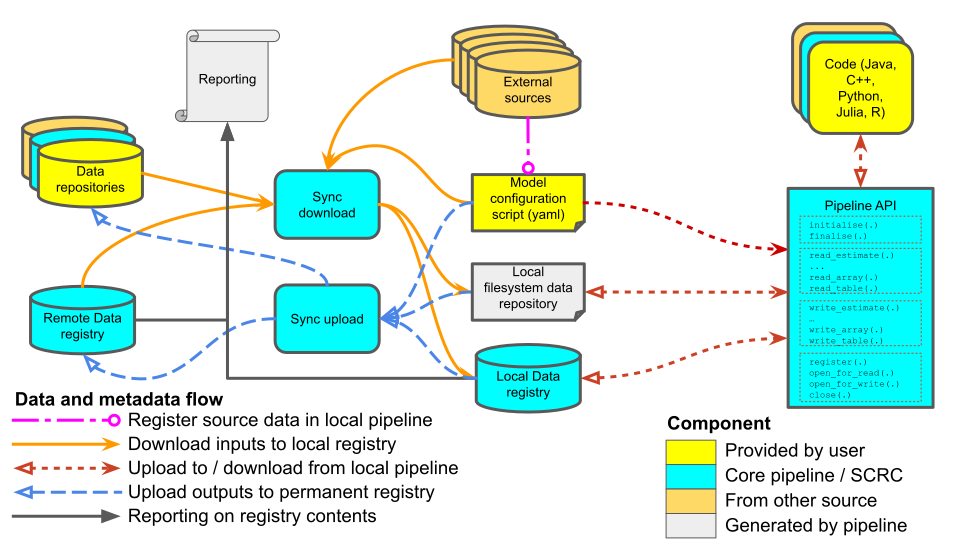

# SCRC data pipeline

The data pipeline is moving towards this new structure:



The API is accessed as a *session*, which corresponds in the registry to a *code run*. All reads and writes are logged directly to a local registry as the session progresses, as is the script which generates that i/o. Files are identified by their metadata, though the metadata is different for reads (where the files must exist) and writes (where they must not). The metadata is also different for *files in core pipeline data formats*, where a significant amounts of metadata are recorded, and *other arbitrary files*, where only a limited amount of data can be collected. Either type of file can be used for input or output, giving a total of four different interactions, two for input and two for output. These differences are described in more detail below.

The underlying data to which the API refers is determined by the interaction between a yaml configuration file (referred to here as a `config.yaml` file, and described below) provided at initialisation and the state of the remote registry at the time of processing of the `config.yaml` by the download synchronisation script (which is considered to contain the definitive version of all data at that time). The specific remote registry used is itself defined in the `config.yaml` file.

This interaction between the configuration file and the remote registry defines the “*local filesystem data repository*” that the local pipeline interacts with. The data directory can be automatically created by a *download synchronisation script* [(currently found here)](https://github.com/ScottishCovidResponse/data_pipeline_api/tree/master/data_pipeline_api/registry) which reads the `config.yaml` file, queries the appropriate remote registry, downloads appropriate data, and populates the local registry with the relevant metadata for those data.

When a model or script is run (as a *session* / “*code run*”), any output files are written to the data directory, and those outputs are logged in the local registry, which has itself been created (or updated) by the *download synchronisation script*. The local registry can be queried to determine whether the data generated is as intended, and if so it can then by synchronised back to the remote registry. This can be carried out automatically using an *upload synchronisation script* [(currently here)](https://github.com/ScottishCovidResponse/data_pipeline_api/tree/master/data_pipeline_api/registry). When the *session* is initialised a “*run id*” is created to uniquely identify that *code run*. It is constructed by forming the SHA1 hash of the configuration file content, plus the date time string.

## config.yaml file format

The config file lets users specify metadata to be used during file lookup for read or write, and configure overall API behaviour. A simple example:

```yaml
fail_on_hash_mismatch: True 
run_metadata: 
  description: "A test model"
  remote_data_registry_url: https://data.scrc.uk/api/ 
  default_input_namespace: SCRC 
  default_output_namespace: johnsmith
  default_data_store: "~/datastore"
  always_copy_to_store: False

read: 
- data_product: human/commutes
    use:
      version: 1.0
- data_product: human/population
    use:
      namespace: eera
      data_product: scotland/human/population
- data_product: human/health
    use:
      cache: "~/local/file.h5"
- external_object: crummy_table
    use:
      doi: "10.1111/ddi.12887"
      title: "Supplementary Table 2"
- external_object: secret_data
    use:
      doi: "10.1111/ddi.12887"
      title: "Supplementary Table 3"
      cache: "~/local/secret.csv"
- object: weird_lost_file
    use:
      hash: b5a514810b4cb6dc795848464572771f
write:
- data_product: human/outbreak-timeseries
    use:
      data_product: scotland/human/outbreak-timeseries
- data_product: human/outbreak/simulation_run
    use:
      data_product: scotland/human/outbreak/simulation_run-{run_id}
- external_object: beautiful_figure
    use:
      unique_name: "My amazing figure"
      version: minor
```

- `default_data_store:` specifies the file system root used for data writes (default “~/datastore”). It may be relative, in which case it is relative to the directory containing the config file. If files already exist in the local filesystem (but not in the datastore), then they will only be copied to the default data store if `always_copy_to_store:` is set to `True` (default `False`).

- Any part of a `use:` statement may contain the string `{run_id}`, which will be replaced with the run id.

- `fail_on_hash_mismatch:` will, if set to True (the default), cause the API to fail is an attempt is made to read a file whose computed hash differs from the one stored in the local registry.

- `run_id` specifies the run id to be used, otherwise a hash of the config contents and the date will be used.

- `run_metadata` provides metadata for the run.

The `data_product:` (within `read:` and `write:`), `external_object:` (`read:` and `write:`) and `object:` (`read:` only) sections specify metadata subsets that are matched in the read and write processes. The metadata values may use glob syntax, in which case matching is done against the glob. The corresponding `use:` sections contain metadata that is used to update the call metadata before the file access is attempted. For reads, a `cache:` may be specified directly, in which case it will be used without any further lookup. If a write is carried out to a data product where no such `data_product:` section exists, then a new data product is created with that name in the local namespace, or the version of an existing data product is suitably incremented. If a write is carried out to an object that is not a data product and no such `external_object:` section exists, then a new object is created with no associated external object or data product, and an issue is raised with the object to note the absence of an appropriate reference, referencing the name given in the write API call.

Any other attributes will be ignored.

## Example use of pipeline

### Read then write a data product component

One of the simplest possible use cases for the pipeline is just to read in a value, calculate a new value from it, and write out the new value. First you need a `config.yaml` file:

```yaml
run_metadata: 
  description: A simple example using data products
  remote_data_registry_url: https://data.scrc.uk/api/ 
  default_input_namespace: SCRC 
  default_output_namespace: johnsmith

read: 
- data_product: human/infection/SARS-CoV-2
```

The download sync using this yaml file will look in the `SCRC` namespace of the remote registry (https://data.scrc.uk/api/) for the latest version of the `human/infection/SARS-CoV-2` data product and download it, syncing all of the associated metadata into the local registry. Then, a script like this (in Julia) will do the actual work:

```julia
using DataPipeline

# Open the connection to the local registry with a given config file
handle = initialise("config.yaml") # How to reference the active script?

# Read in the estimate of a value from a toml file
inf_period = read_estimate(handle,
                           name = "human/infection/SARS-CoV-2",
                           component = "infectious-duration")

# Do some exciting processing
double_period = inf_period * 2

# Write out the newly created value to a toml file
write_estimate(handle, double_period,
               name = "human/infection/SARS-CoV-2/doubled",
               component = "doubled-infectious-period")

finalise(handle)
```

This script will find the latest version of the `human/infection/SARS-CoV-2` data product in the local registry, read the file and find the `infectious-duration` component. It will then double it and save the new value to disk as the `doubled-infectious-period` component of the `human/infection/SARS-CoV-2/doubled` data product, and record its existence in the local registry. When saving the metadata to the registry, that will include its provenance -- that it depends on the old value and was generated by the script being executed.

### Read then write an external object

A script to read and write an external object (i.e. something not in a core data pipeline format). First, the yaml file, that gives the `doi_or_unique_name` and `title` of the external objects being read and written, and the aliases that will be used in the file:

```yaml
run_metadata: 
  description: A simple example using external objects
  remote_data_registry_url: https://data.scrc.uk/api/ 
  default_input_namespace: SCRC 
  default_output_namespace: johnsmith

read: 
- external_object: "time-series"
    use:
      unique_name: "An exciting time series"
      title: "Table 1"

write:
- external_object: "revised-time-series"
    use:
      unique_name: "An new, revised, time series"
      title: "Table 1"
      primary: True
```

Then the R script reads in the original data, modifies it and saves it to disk as a csv file, registering it in the local registry as an external object:

```R
library(DataPipeline)
library(readr)
library(dplyr)

# Open the connection to the local registry with a given config file
handle <- initialise("config.yaml") # How to reference the active script?

# Read in a csv file stored in the pipeline
time_series <- read_csv(pipeline_record_open(handle, "time-series"))

new_time_series <- time_series %>% select(time, pipes) %>% filter(time < 10)

write_csv(new_time_series,
          pipeline_record_write(handle, "revised-time-series"))

finalise(handle)
```

### Register a new external object in the pipeline

Here, we'll download some data from outside the pipeline, do some processing, and record the original file and the resultant data product into the pipeline. First the yaml file, specifying where the external object comes from:

```yaml
run_metadata: 
  description: Register a file in the pipeline
  remote_data_registry_url: https://data.scrc.uk/api/ 
  default_input_namespace: SCRC 
  default_output_namespace: johnsmith

register:
- external_object: "contact-matrix"
    use:
      source_url: "https://data.scrc.uk/data_product/LSHTM:contact_matrices/national@0.20200811.0"
      cache: ~/cache/national@0.20200811.0.csv
      unique_name: "An new, revised, time series"
      title: "Table 1"
      primary: True
      author: "John Smith"
      source: "LSHTM"
```

Then the python script:

```python
from data_pipeline_api.standard_api import StandardAPI

with StandardAPI.from_config("config.yaml") as api:
    api.register("contact-matrix")
    matrix = read(api.record_open("contact-matrix"))
    api.write_array("human/movement", "contact_matrix", matrix)
```

This registers an external object, reads it in, and then writes it back to the pipeline as a data product component.

### Another example of a an external object

Note that this is another made up example that hasn't been tested.

```yaml
run_metadata:
  description: Register a file in the pipeline
  remote_data_registry_url: https://data.scrc.uk/api/
  default_input_namespace: SCRC
  default_output_namespace: johnsmith

register:
- external_object: raw-mortality-data
  use:
    source:
      name: Scottish Government Open Data Repository
      abbreviation: Scottish Government Open Data Repository
      website: https://statistics.gov.scot/
    downloaded_from:
      name: Scottish Government Open Data Repository
      root: https://statistics.gov.scot/sparql.csv?query=
      path: |
        PREFIX qb: <http://purl.org/linked-data/cube#>
        PREFIX data: <http://statistics.gov.scot/data/>
        PREFIX rdfs: <http://www.w3.org/2000/01/rdf-schema#>
        PREFIX dim: <http://purl.org/linked-data/sdmx/2009/dimension#>
        PREFIX sdim: <http://statistics.gov.scot/def/dimension/>
        PREFIX stat: <http://statistics.data.gov.uk/def/statistical-entity#>
        PREFIX mp: <http://statistics.gov.scot/def/measure-properties/>
        SELECT ?featurecode ?featurename ?areatypename ?date ?cause ?location ?gender ?age ?type ?count
        WHERE {
         ?indicator qb:dataSet data:deaths-involving-coronavirus-covid-19;
           mp:count ?count;
           qb:measureType ?measType;
           sdim:age ?value;
           sdim:causeOfDeath ?causeDeath;
           sdim:locationOfDeath ?locDeath;
           sdim:sex ?sex;
           dim:refArea ?featurecode;
           dim:refPeriod ?period.

           ?measType rdfs:label ?type.
           ?value rdfs:label ?age.
           ?causeDeath rdfs:label ?cause.
           ?locDeath rdfs:label ?location.
           ?sex rdfs:label ?gender.
           ?featurecode stat:code ?areatype;
             rdfs:label ?featurename.
           ?areatype rdfs:label ?areatypename.
           ?period rdfs:label ?date.
        }
      accessibility: 0
    stored_in:
      name: Local store
      path: ~/datastore/eb788dd5d4cf6345c0c74535031088927918f64b.csv
      accessibility: 0
    cache: ~/datastore/eb788dd5d4cf6345c0c74535031088927918f64b.csv
    data:
      unique_name: scottish deaths-involving-coronavirus-covid-19
      product_name: records/SARS-CoV-2/scotland/human-mortality
      title: scottish deaths-involving-coronavirus-covid-19
      primary: True
      release_date: 2021-04-01
      description: scottish deaths-involving-coronavirus-covid-19 dataset
      version: 0.20210401.0
```
